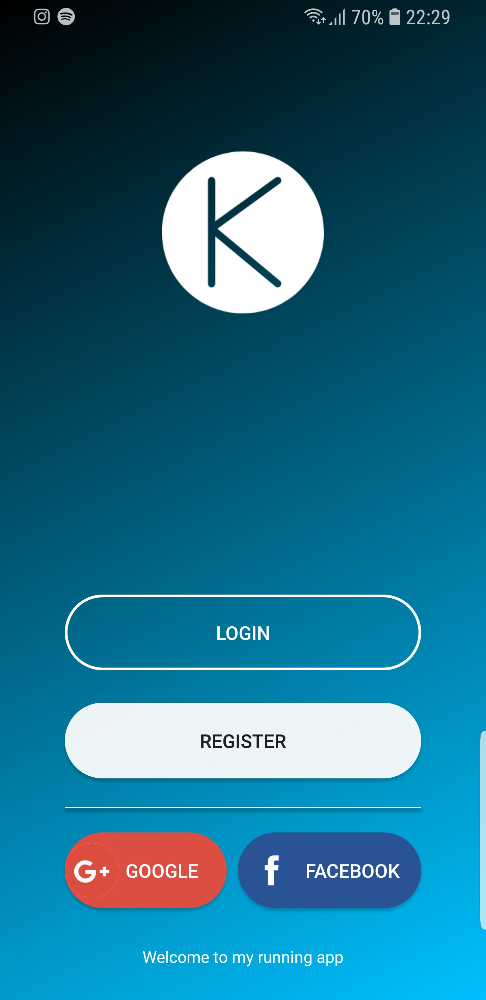
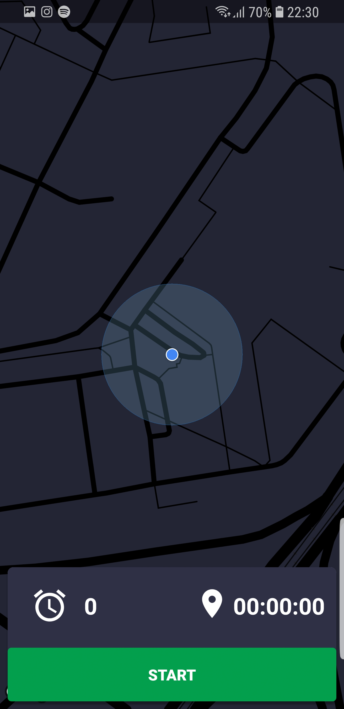
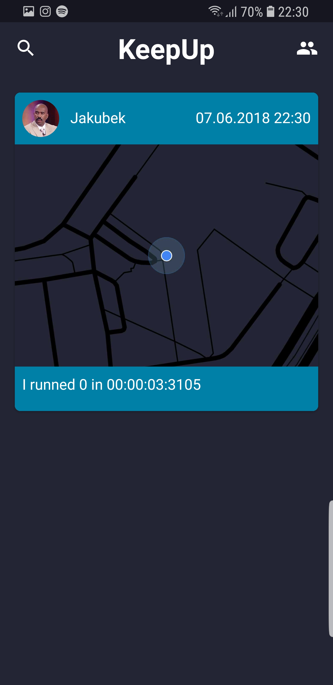
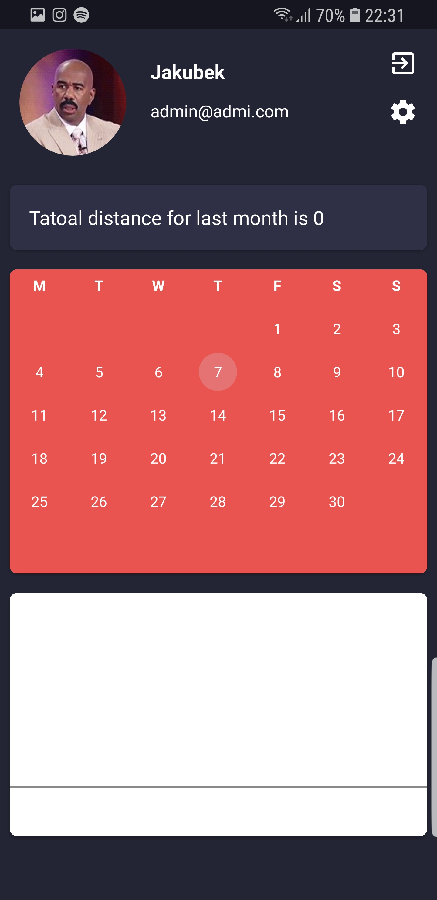
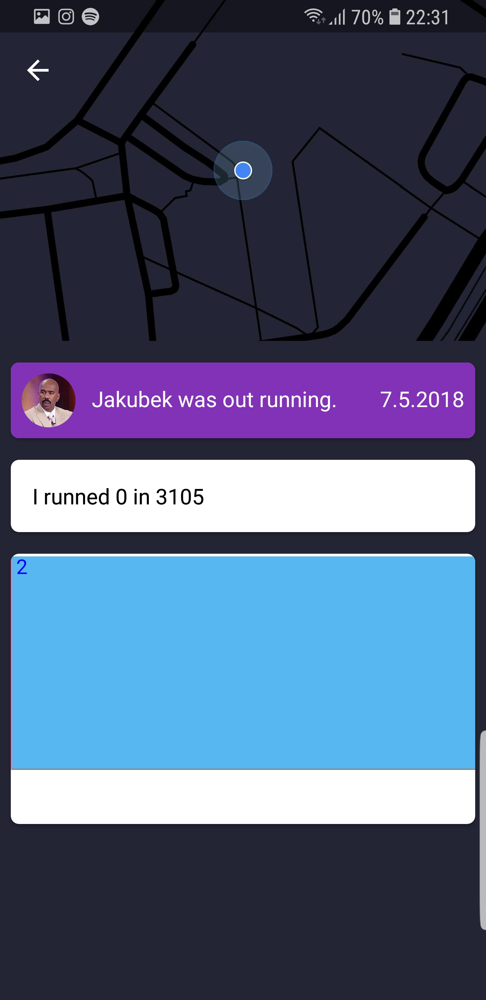

# KeepUp

Android app build with JAVA which will keep track your sport activity.
Using firebase for login and user data. This app is still under construction.
Planned comeback is in october 2018.

## Screenshots

  
  

## Using

* [Firebase](https://tympanus.net/codrops/) - Firebase login
* [materializecss](https://materializecss.com/) - Frontend framework

## License

This project is licensed under the MIT License - see the [LICENSE](https://github.com/kubekbreha/KeepUp/blob/master/LICENCE) file for details
